# 👋 Hi, I'm Azwad Hussain Shadman
### 💻 FullStack Developer | MERN Stack Developer | ⚡ Problem Solver

---

## 🙋 About Me
I'm a passionate Web Developer who loves building modern, scalable, and user-friendly applications. I mainly work with **React and Next.js**, and I'm constantly sharpening my skills across both frontend and backend development. Alongside web development, I enjoy competitive programming and occasionally build small games for fun.

---

## 🎯 Current Activities
- 🌱 Consistent  On  **Next.js** and Full Stack Development
- 🌍 Working on a **Mern Stack Project** using Next.js & MongoDB
- 🧠 Practicing **Data Structures & Algorithms**
- 🎮 Built a 2D game using **C/C++ & raylib**

---

## 🛠️ Skills

**Languages**

  

**Frontend**

  

**Backend**

  

**Tools & Concepts**

  

---

## 📌 Featured Projects
- 🌍 **Ticket Bari** — An  web application built with Next.js, BetterAuth, MongoDb,Express.js.
- 🛒 **Pet Adoption** — Focused on clean UI, performance, and user experience.

---

## 🌐 Connect With Me

  
  

---
## 📊 GitHub Stats
## 📊 GitHub Stats

  

## ⚡ Developer Mindset
I focus on building **real-world web applications**, writing **clean and maintainable code**, and continuously learning new technologies to grow as a developer.
